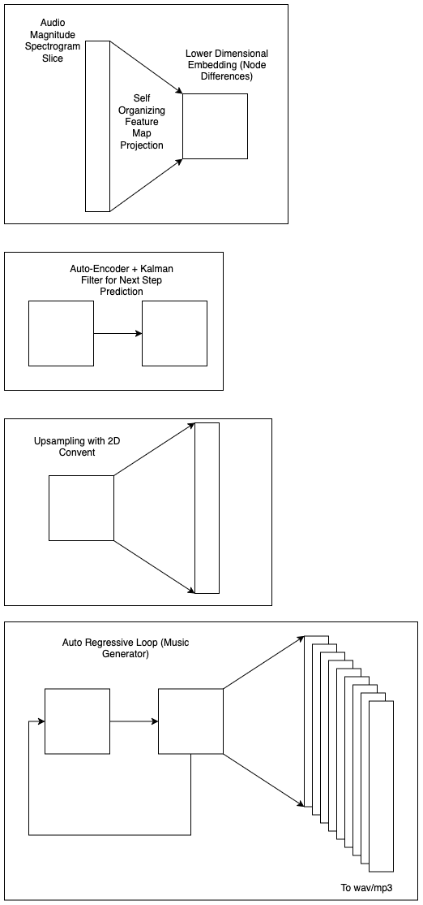

# papagayo
A Birdsong Synthesizer

## Background

Papagayo is an exploration of birdsong, machine learning, audio processing, and generative music, resulting in two prototype tools:

1. Timbre Transfer
2. Music Generator

### Birdsong Dataset  
Australian birdsong recordings were sourced from [xeno-canto.org](https://www.xeno-canto.org/):  
- Superb Lyrebirds  
- Butcherbirds  
- Magpies  
- Kookaburras  
- Noisy Friarbirds  
- Lorikeets  
- Mixed Australian birdsong samples  

### ML Components
- **Self-Organizing Feature Maps (SOFM)**: Embeds audio data into a lower-dimensional representation.  
- **2D Convolutional Network**: Upsamples embeddings into high-dimensional magnitude spectrogram slices.  
- **Autoencoder + Kalman Filter**: Predicts the next embedding state (quick to train but lacks long-term dependencies; a 3D ConvNet or Transformer may be better suited).  

  

<!-- ## Visualizations with Sound

To demonstrate intuitively how SOFMs can embed/encode audio, videos of songs processed by a SOFM trained on Australian Birdsong slices are provided to download here:

### [Download Embedding Video Drum of Track (MP4)](https://raw.githubusercontent.com/ljan7237/papagayo/blob/main/examples/videos/drum.mp4)
### [Download Embedding Video of Butcherbird Song (MP4)](https://raw.githubusercontent.com/ljan7237/papagayo/blob/main/examples/videos/butcherbird.mp4) -->

---

# Applications

## Timbre Transfer  
A trained SOFM can embed birdsong (or any sound). New input audio is projected through the SOFM, enabling distance comparisons between input song slices and birdsong slices. The closest matches are used to reconstruct the input song using birdsong samples.  

## Songbird/Music Generator  

1. **Self-Organizing Feature Map Embedding**  
   - Audio is processed via the Short-Time Fourier Transform (STFT) and mapped onto SOFMs.  
   - The SOFM embeddings provide a lower-dimensional representation of the input.  
   - New audio can be embedded and compared to existing embeddings.  

2. **Autoencoder + Kalman Filter for Next-Step Prediction**  
   - Given an embedding at time step *t*, the model predicts the embedding at *t+1*.  

3. **2D Convolutional Network Upsampling**  
   - Uses the topology of SOFM embeddings to upsample back to the original spectrogram space.  

Combining (i) trained SOFMs, (ii) ConvNet upsampling, and (iii) Autoencoder+Kalman filters, Papagayo generates music autoregressively.  

---

# Installation & Usage

## Installation  
```
pip install -r requirements.txt
```
(*Tested on macOS with an M3 chip; other OSs not verified.*)  

---

## Processing Audio
### Perform STFT on input audio  
```
python stft/stft.py --audio-dir path/to/audio --output-dir path/to/audio_slices/ --save-phase --num-workers 4
```
(Saves phase information for reconstruction.)  

---

## Embedding Audio Data
### Using a trained SOFM (e.g., butcherbirds 8×8 SOFM trained for 200 epochs):  
If embedding the raw training data:  
```
python embed/embed.py --raw-data path/to/audio_slices.npy \
    --trained-som data/models/butcherbird/som_net/butcherbirds_8x8_som_net_200_epochs.npy \
    --output-file data/models/butcherbird/training_data/embeddings/butcherbird_embeddings.npy
```
If embedding new/unseen data (requires raw training data for scaling):  
```
python embed/embed.py --raw-data path/to/audio_slices.npy \
    --trained-som data/models/butcherbird/som_net/butcherbirds_8x8_som_net_200_epochs.npy \
    --output-file path/to/new_input_audio_slices.npy
```

---

## Timbre Transfer (Finding Closest Matches)  
```
python match_embeddings/match_embeddings.py --new-data path/to/new_embedding.npy \
    --birdsong-embeddings path/to/birdsong_embedding.npy \
    --birdsong-slices path/to/birdsong/slices.npy \
    --output-slices path/to/reconstructed_slices.npy
```

---

## Generating a Timbre-Transferred Song  
```
python song_generator/generate.py --audio-path path/to/input/song.mp3 \
    --spectrogram-path path/to/song/slices.npy \
    --phase-path path/to/song/phase.npy \
    --output-wav path/to/output.wav \
    --output-mp3 path/to/output.mp3
```

---

## Post-Processing (Denoising, Compression, Smoothing)  
```
python audio_post_process/post_process.py --input-mp3 path/to/generated_song.mp3 \
    --output-wav path/to/generated_song_post_processed.wav \
    --output-mp3 path/to/generated_song_post_processed.mp3 \
    --prop-decrease 0.8 --compress --low-pass 3000 --high-pass 100
```

---

## Upsampling Audio  
```
python upsampler/upsample_inference.py --input-data path/to/embeddings.npy \
    --model-path path/to/prediction_cnn_model.pth \
    --output-path path/to/slice_inferences.npy
```

### Generating an Upsampled Song  
```
python song_generator/generate.py --audio-path path/to/original/audio.mp3 \
    --spectrogram-path path/to/upsampled_slices.npy \
    --phase-path path/to/original/audio/phase.npy \
    --output-wav path/to/generated/song.wav \
    --output-mp3 path/to/generated/song.mp3
```

---

## Autoregression (Music Generation)  
Requires:  
- A trained **SOFM network** (*train_som/train_som_net.ipynb, Google Colab*).  
- A trained **2D ConvNet upsampler** (*upsampler/train_upsampler.ipynb, Google Colab*).  
- A trained **Autoencoder + Kalman Filter** (*train_autoencoder/train_auto_encoder.py*).  

Given an initial embedding, the autoregressor recursively predicts the next embeddings, upscales them to the original audio space, and reconstructs a song.  

```
python autoregressor/autoregressor.py --initial-input path/to/starting_point_embedding.npy \
    --num-steps 20000 \
    --output-file AI_birdsong.npy --to-wav
```
(*Saves AI_birdsong.mp3 and AI_birdsong.wav*)  

---

# Examples  
Generated audio samples from:  
- Timbre Transfer  
- Upsampling  
- Autoregression  

Available in the `examples/` directory.  

---

# Limitations & Future Work  

## Current Limitations  
- **Autoencoder for next-state prediction is limited**: No long-term dependencies; consider 3D ConvNet (predicting with multiple past samples) or a Transformer.  
- **Distance measures**: Currently uses Frobenius norm—try cosine similarity, Manhattan distance, etc.  
- **Mono processing only**: Extend to stereo.  
- **Hyperparameter tuning**: Optimize SOFM, Autoencoder+Kalman Filter, and ConvNet models.  
- **Data cleaning**: Training data contains ambient noise.  
- **Phase reconstruction**: Needs improvement.  
- **Higher resolution slicing**: Experimentation needed.  
- **Testing**: More validation required.  

## Future Directions  
- **Interactive "Draw a Song" Instrument**  
  - Utilize SOFMs’ topology to allow users to "draw" a song.  
  - Could serve as a generative music tool.  
